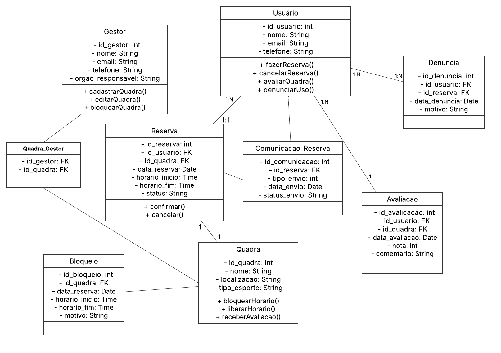
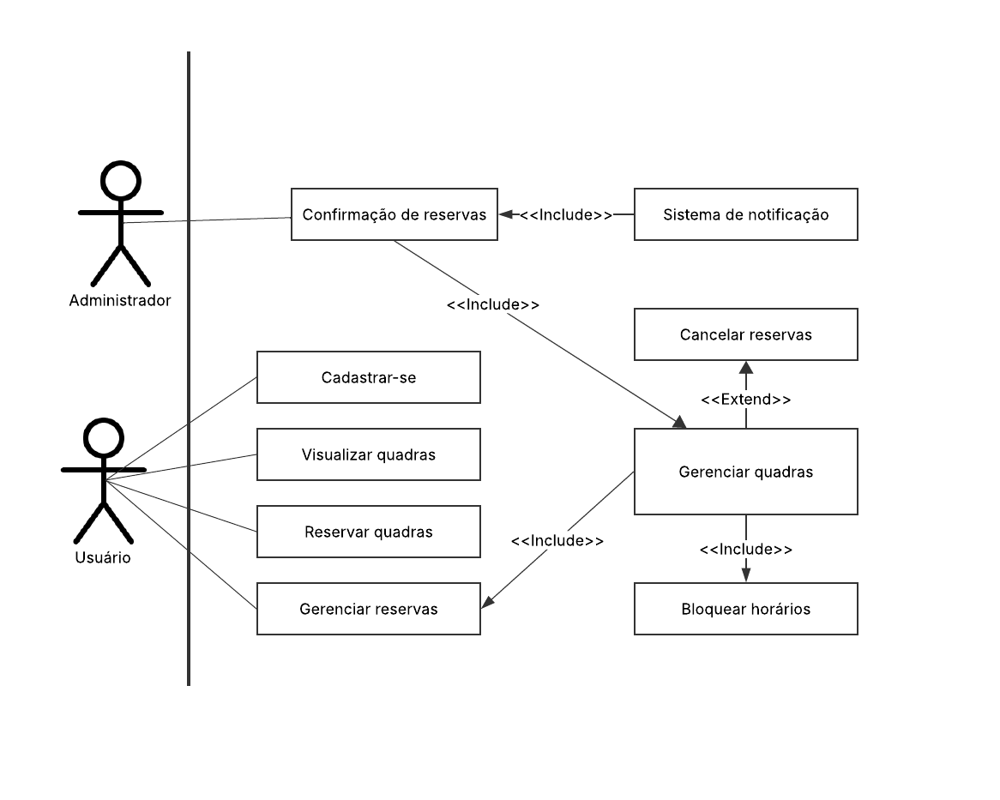

## Problemática

Atualmente, muitas quadras esportivas públicas ou comunitárias enfrentam problemas recorrentes de falta de organização no uso, acessos desiguais e baixa comunicação entre usuários e administradores. A ausência de um sistema centralizado e digital dificulta o processo de reserva, levando a conflitos de horário, ocupações indevidas, e até o uso repetido por poucos usuários em detrimento da comunidade. Além disso, não há uma forma eficiente de controlar a disponibilidade, bloquear horários para manutenção, ou coletar feedback dos usuários sobre a qualidade das quadras e comportamentos inadequados.

Essa desorganização compromete a experiência dos frequentadores, gera desgastes entre usuários e gestores, e impede que o uso das quadras seja justo, transparente e otimizado.

## Objetivo do projeto

O objetivo final é democratizar e organizar o acesso a espaços esportivos, promovendo maior inclusão, transparência e cuidado com os recursos públicos ou coletivos.

## 8 REQUISITOS FUNCIONAIS
- Cadastro Simples de Usuários
  - Registro simplificado (apenas nome, email e senha)
- Visualização de Quadras e Horários Disponíveis
  - Lista das quadras filtradas por esporte (vôlei, beach tênis, etc.), localização e horário livre. Bem como, imagem das quadras.
- Sistema de Reserva Gratuita
  - Seleção de horário e quadra disponível, com confirmação instantânea.
  - Limite de reservas por usuário de 2h por dia e quadra para evitar abusos.
- Gestão de Reservas pelo Usuário
  - Painel do usuário com suas reservas ativas e histórico.
- Painel de Administração para Gestores
  - Cadastro e edição de quadras por responsáveis (prefeitura, associação, etc.).
  - Bloqueio de horários para manutenção ou eventos especiais.
- Avaliações e Denúncias
  - Usuários podem avaliar a condição da quadra (limpeza, iluminação).
  - Sistema de denúncia para reservas indevidas ou mau uso.
- Cancelamento Autônomo
  - Opção de cancelamento direto pelo usuário até 1 horas antes do horário.
- Confirmação por E-mail/SMS
  - Envio automático de comprovante de reserva com detalhes (local, horário, regras).

## 3 TELAS PROTOTIPADAS NO FIGMA (SIGNIN, SIGNUP, TELA PRINCIPAL)
-[Telas desenvolvidas](https://www.figma.com/file/OXTSbj3H4YIdDJvgfaNx1d?node-id=0:1&locale=en&type=design)
## DER COM PRINCIPAIS TABELAS CRIADAS
  

## FLUXOGRAMA DO SISTEMA

## CASOS DE USO

